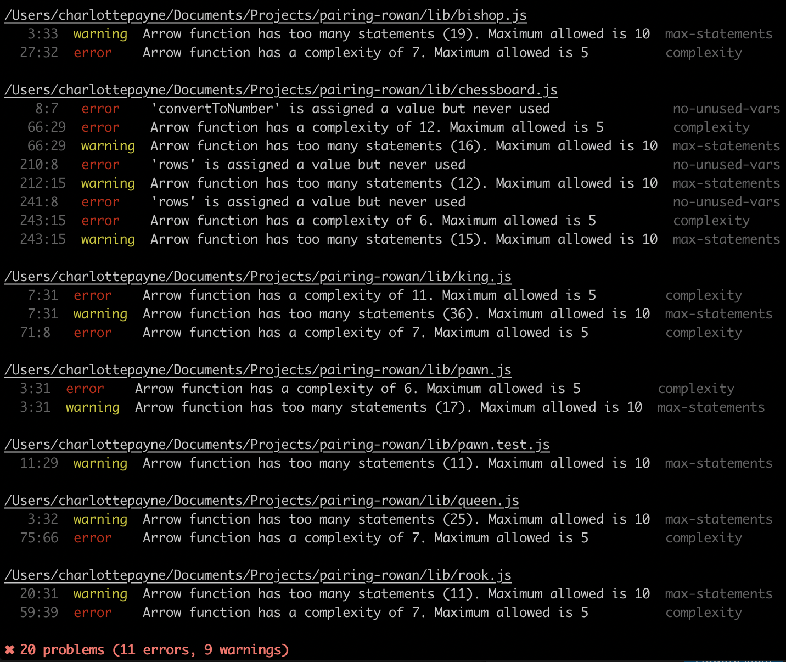
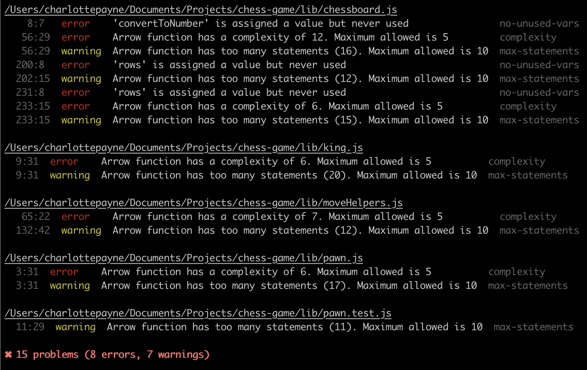

# Chess Game

Exploring DOM manipulation and declarative JavaScript in the creation of a chess game. Current game is pass and play.

The codebase for this game has been used to explore cyclomatic complexity (and ESlint rules relevant to this) as a measure of code quality and complexity.

### Next Steps:

-   Valid en passant capture by a pawn, on the move follow the opponent pawn's double-move

    -   Could this be done by checking the previous state of the board, only when the pawn is on the opposite middle row, and there is an opponent pawn directly next to you on the same row.
    -   En Passant is only triggered by a pawns first move being two squares.
    -   What if ever piece also stored it's past position.

-   Promotion for a pawn when reaches all the way to back line

    -   Change the board object so it's an object with a board property that is the array of squares
    -   Plus an array of pieces taken as need to keep track of all the pieces taken during the game.
    -   movePiece would be extended to also update this second array with the piece now taken.
    -   UI for player to choose what they want to promote the pawn to

-   Include rook logic for 'castling' - the rook and king participate in a special move called castling.

-   Know which player is which / who's turn it is

### Other Ideas:

-   Solve the immutable / mutable debate:

    1. Could only store the position that hold a piece then re-render these over the table each time something changes
    2. Have the new board as one array, old board as separate array and loop over the boards and mark the changes.
       Also need a map of all the table cells with their current corresponding position.
       The td would always remain on the screen
       Caveat - the UI would never be immutable. (E.g. react just diffs the DOM and shadow DOM)

-   Chess move notation - coordinates instead of just row / col numbers. This abstracts away the rows and cols /
-   Zero indexing this would be a-h is cols / 8-1 rows
-   Interim interactive version in pure js
-   React version for presentation and interaction

### Refactoring

-   Could be a series of rules that compose a kingValidMoves() e.g. allDiagonalMoves(Infinity) allowJumping(). You could read the instructions for what a king can and can't do in this chain of declarative functions. The finer logic would be abstracted away.

### Cyclomatic Complexity

#### Project Goals:

Understand the value of testing for 'complexity' in code. On first hearing about the mathmatical notion of [cyclmatic complextity](https://en.wikipedia.org/wiki/Cyclomatic_complexity) I immediately wondered how useful it would be - checking of linearly independent paths through a program did not feel full proof. Yes, I felt that deeply nested if/else blocks were not a good thing but could this not be avoided by modularising your code very heavily? Or subject to your coding paradigm of choice (object orientated vs functional programming). I.e. wouldn't lots of classes, using inheritance fail to trigger a high complexity score, despite a developer needing to navigate and retain lots of different chunks of logic in order to understand 'what does this code do'.

For me complexity is 'how quickly can I understand this code'? But that's qualitative...

#### Investigation:

-   Benchmark current complexity using Eslint Rules
-   Benchmark current complexity using Lizard
-   What is valuable about measuring 'complexity' AKA linearly independent paths through code.
-   Complexity analysis can be one dimensional.
-   Correlating complexity with other variables usually reveals a much more useful insight.
    -   For example, plotting cyclomatic complexity vs time will display the dynamics of the code as the engineers refactor some parts or rewrite other stuff.
    -   Mapping complexity with different modules may give some hints as to which modules still need more TLC.

First measure (19 October 2019):


Most Complected Logic:

1. `kingValidMoves` - 36 statements // 11 linearly independent paths // 7 linearly indepmendent paths
2. `queenValidMoves` - 25 statements // 7 linearly independent paths
3. `bishopValidMoves` - 19 statements // 7 linearly independent paths

Questions:

-   Is there anything wrong with this many linearly independent paths objectively a problem?
    -   In the [Eslint](https://github.com/eslint/eslint/issues/4808) discussion of this complexity rule they note that the "highest we have within ESLint code is 36, but there are only 6 above 20. Maybe 20 is a good number?"
    -   What is a sensible limit?
    -   "Regardless of the exact limit, if cyclomatic complexity exceeds 20, you should consider it alarming."
    -   20 === really badly designed code
    -   10 === upper bound of what is sensible - ["In the 2nd edition of Steve McConnell's Code Complete he recommends that a cyclomatic complexity from 0 to 5 is typically fine, but you should be aware if the complexity starts to get in the 6 to 10 range. He further explains that anything over a complexity of 10 you should strongly consider refactoring your code."](https://elijahmanor.com/control-the-complexity-of-your-javascript-functions-with-jshint/)
-   What other factors indicate that code is hard to maintain - number of params, depth, number of statements.

Refactor #1:

-   Reduce verbose repetative statements in `kingValidMoves`
-   Look for the same logic being repeated with small variation - extract this into another function.
-   Identify helper functions that could be relevant to other valid moves functions
-   What is causing so many linearly independent paths? Could this be reduced?
-   Results by commit https://github.com/CLTPayne/pairing-rowan/commit/c8957389b7b419068784449f95c143553e01d1ff:
-   Extracted quite a lot of logic to shared moveHelpers.js. This feels like it's gaming the complexity measures.
    -   `kingValidMoves` - 21 statements // 6 linearly independent paths

_Results_ - Don't feel that using the complexity out put to guide refactoring has created optimal code. It is more expressive, and it's less imperative but there is further it could go. Check out commit 565079b6991e6223b50771b46e737f92ecb41e09 to compare.

Refactor #2:

-   Focus on the highlevel logic for each function - see pseudo code file at pseudoCode.js
-   Goal of refactor is the most readable, declarative code.
-   You shouldn't need to know how to play chess in order to understand the code / rules for each piece

Second measure (2nd Nobember 2019):


_Results_ - Quite a lot of complexity has been shifted to the `moveHelpers.js`. Completely removed Queen and Rook from the list of complexity issues thanks to the `getPotentialHorizontalOrVerticalMoves` abstraction however this obscures the fact that the shared `validateMoves` and `getPotentialDiagonalMoves` logic is still triggering an complexity error. As these pieces don't have additional complexity like check they are now Checkout commit 8de6b6a656325815830882d2acd4f2a93283ac4b to compare. This again highlights the issue with these complexity measures - it's shifting the complexity but not removing it altogether.

Refactor #3:

-   Idea for making the old school javascript for loops more explicit? label them? https://developer.mozilla.org/en-US/docs/Web/JavaScript/Reference/Statements/label

Update Gameplay:
DataStructure Refactor for special rules:

Move:

```{
				col: 5,
				color: "black",
				piece: {
					color: "black",
					type: "pawn",
                         hasMoved: boolean,
				},
				row: 4
			}
```

```
const game = {
     board: [], // same as existing board structure
     capturedPieces: [], // adding a copy of the object before it gets deleted from the board
     history: [{
                    startSquare: {col: 1, row: 1}
                    endSquare:  {col: 2, row: 1}
                    pieceThatMoved: {
                         color: "black",
                         type: "pawn",
                    },
                    pieceCaptured: {

                    }
               }]
     },
}
```

File === column on chessboard

Approach:

1. Update movePiece() to save the hasMoved property in board
2. Implement castling logic:

Castling:

1. Check that King hasn't moved
2. Check that neither of the rooks has moved
   if on of the is still in start position continue
3. Check that the squares between the king and any not moved rook are empty
4. Check the empty squares AND the king's current position are not in check
5. If all fine, king moves two squares towards the rook across the row.

En Passant:

1. Create Game object
2. movePiece is responsible calling what ever function

### GitHub Pages

-   GitHub pages use https://jekyllrb.com/ under the hoood.
-   GitHub pages looks for your index.html by default. (So change chessboard.html to index.html)
-   Can point the DNS to a personal domain
-   If not using a personal domain the repo name is part of the URL (So remame the repo to chess game.)
