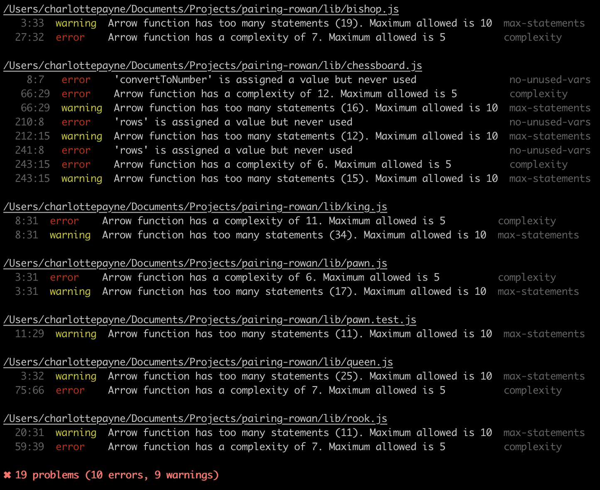

## Next Steps:

-   Valid moves per piece - `pawnValidMoves`
-   Valid en passant capture by a pawn, on the move follow the opponent pawn's double-move

-   Promotion for a pawn when reaches all the way to back line
-   UI for player to choose what they want to promote the pawn to
-   Need to keep track of all the pieces that are being taken

-   Chess move notation - coordinates instead of just row / col numbers. This abstracts away the rows and cols /
-   Zero indexing this would be a-h is cols / 8-1 rows
-   Interim interactive version in pure js
-   React version for presentation and interaction
-   Know which player is which

-   OOP version

-   Fix all pieces for being able to take king or not take king in a normal move
-   Include rook logic for 'castling' - the rook also participates, with the king, in a special move called castling.

### Latest Ideas:

-   Solve the immutable / mutable debate:
    1. Could only store the position that hold a piece then re-render these over the table each time something changes
    2. Have the new board as one array, old board as separate array and loop over the boards and mark the changes.
       Also need a map of all the table cells with their current corresponding position.
       The td would always remain on the screen
       Caveat - the UI would never be immutable. (E.g. react just diffs the DOM and shadow DOM)

### Refactoring

-   Could be a series of rules that compose a kingValidMoves() e.g. allDiagonalMoves(Infinity) allowJumping

### Cyclomatic Complexity

#### Project Goals:

Understand the value of testing for 'complexity' in code. On first hearing about the mathmatical notion of [cyclmatic complextity](https://en.wikipedia.org/wiki/Cyclomatic_complexity) I immediately wondered how useful it would be - checking of linearly independent paths through a program did not feel full proof. Yes, I felt that deeply nested if/else blocks were not a good thing but could this not be avoided by modularising your code very heavily? Or subject to your coding paradigm of choice (object orientated vs functional programming). I.e. wouldn't lots of classes, using inheritance fail to trigger a high complexity score, despite a developer needing to navigate and retain lots of different chunks of logic in order to understand 'what does this code do'.

For me complexity is 'how quickly can I understand this code'? But that's qualitative...

#### Investigation:

-   Benchmark current complexity using Eslint Rules
-   Benchmark current complexity using Lizard
-   What is valuable about measuring 'complexity' AKA linearly independent paths through code.
-   Complexity analysis can be one dimensional.
-   Correlating complexity with other variables usually reveals a much more useful insight.
    -   For example, plotting cyclomatic complexity vs time will display the dynamics of the code as the engineers refactor some parts or rewrite other stuff.
    -   Mapping complexity with different modules may give some hints as to which modules still need more TLC.

First measure (19 October 2019):

Most Complected Logic:

1. `kingValidMoves` - 34 statements // 11 linearly independent paths
2. `queenValidMoves` - 25 statements // 7 linearly independent paths
3. `bishopValidMoves` - 19 statements // 7 linearly independent paths

### GitHub Pages

-   use https://jekyllrb.com/
-   change chessboard.html to index.html
-   can point the DNS to a personal domain
-   remame the repo to chess game
